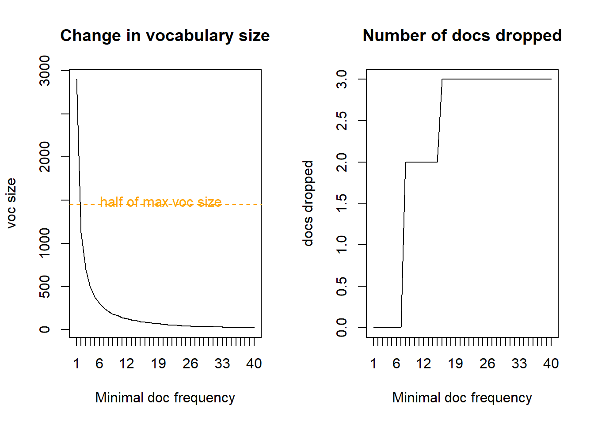
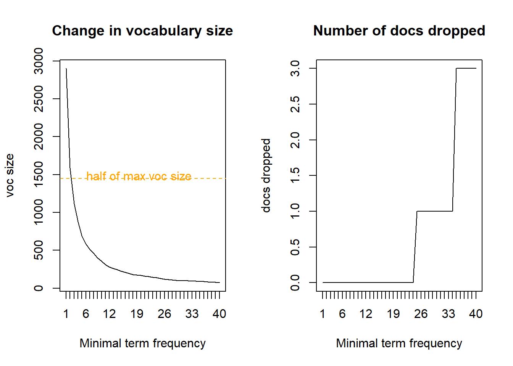
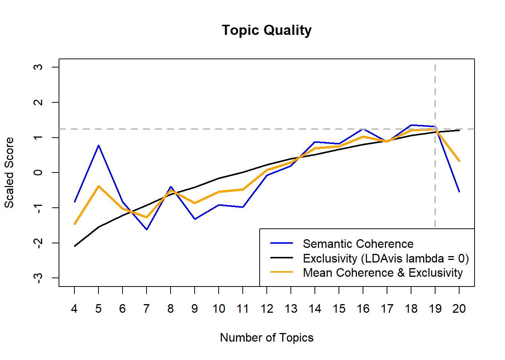
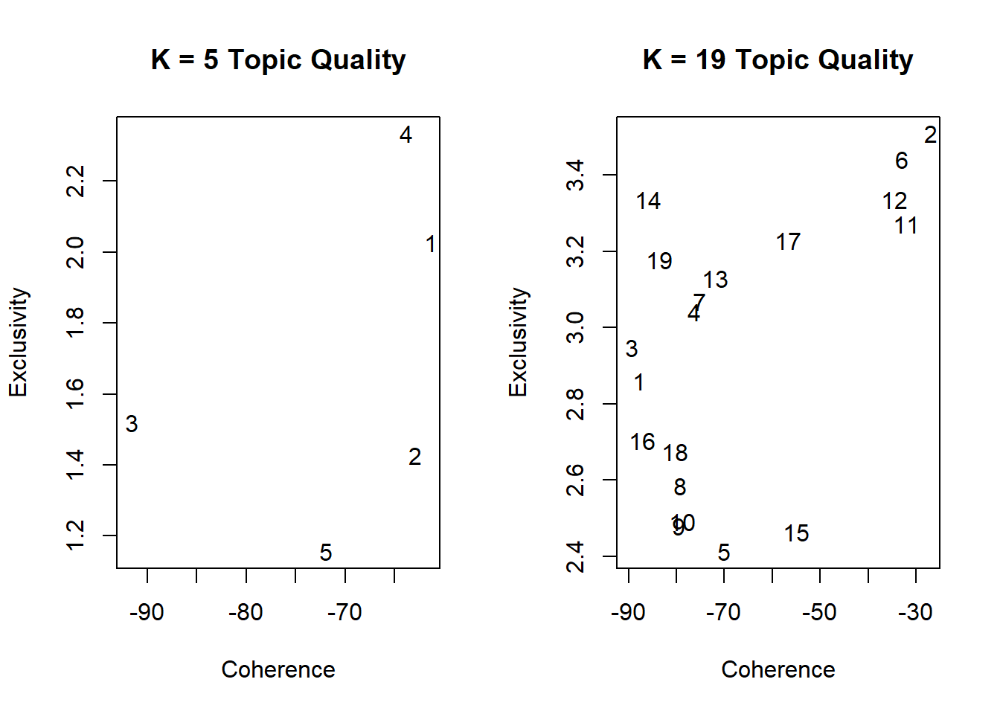
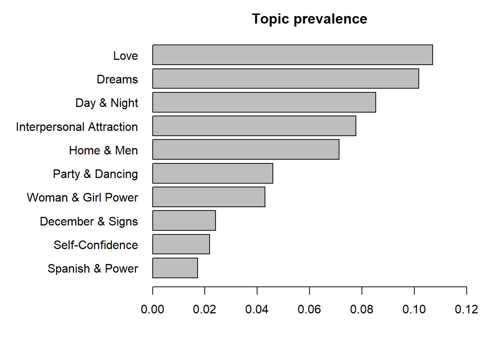
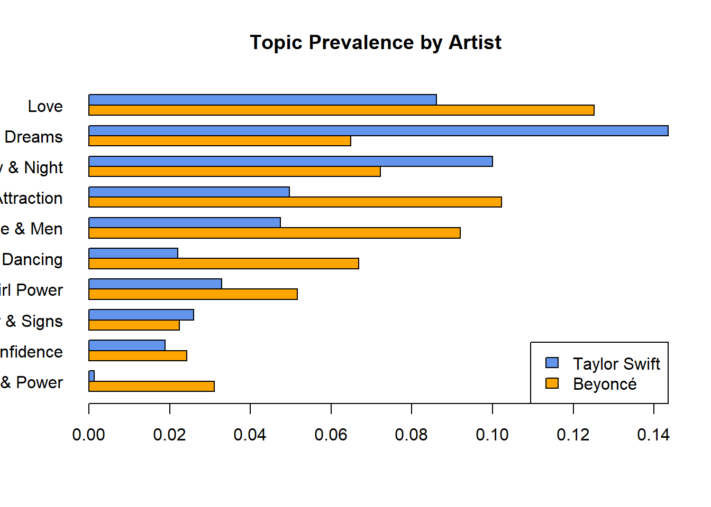
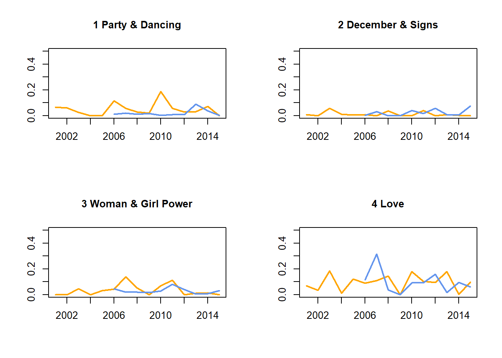
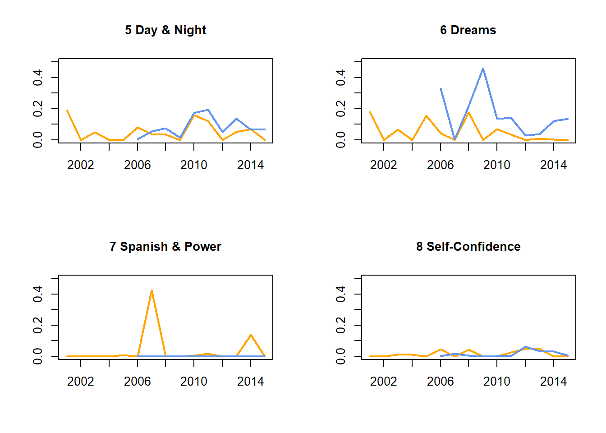
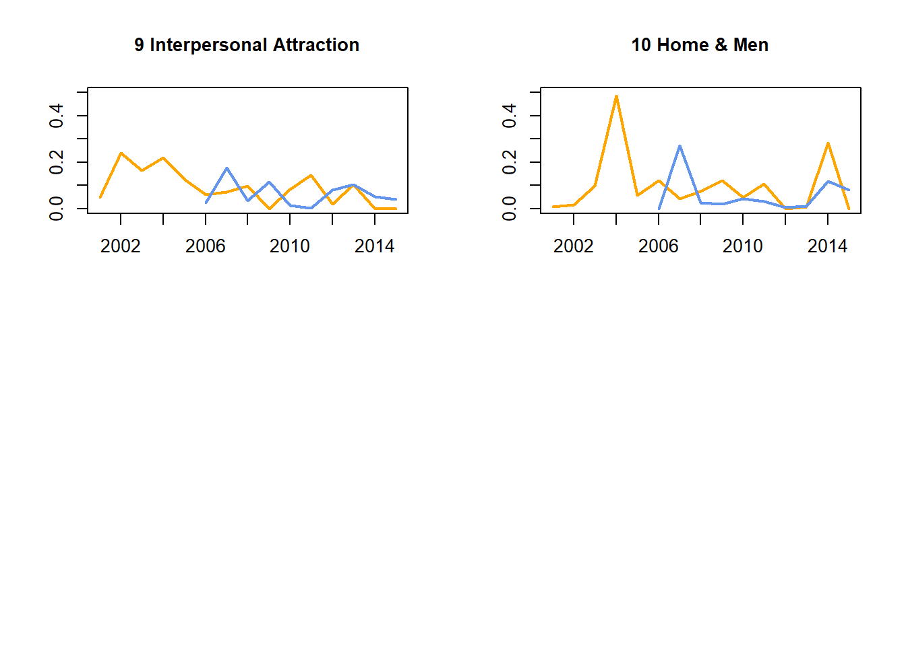

# Info

This is the markdown for the example analysis presented in the [PTOS Topic Modeling](https://leibniz-psychology.org/en/opensciencelectures/topic-modeling/) lecture. Here, a topic modeling workflow is presented using song lyrics as an example.

# Libraries


```r
# web scraping
library(httr)
library(XML)

# text processing
library(textclean)
library(quanteda)

# topic modeling
library(ldaPrototype)
library(tosca)

# networks
library(igraph)
library(visNetwork)
```

# Get data

## Retrieve from GitHub

We use the song lyrics datasets from [tidytuesday](https://github.com/rfordatascience/tidytuesday).


```r
# get data from https://github.com/rfordatascience/tidytuesday/tree/master/data/2020/2020-09-29
taylor_swift_lyrics <- read.csv("https://raw.githubusercontent.com/rfordatascience/tidytuesday/master/data/2020/2020-09-29/taylor_swift_lyrics.csv")
beyonce_lyrics <- read.csv("https://raw.githubusercontent.com/rfordatascience/tidytuesday/master/data/2020/2020-09-29/beyonce_lyrics.csv")

# inspect
names(taylor_swift_lyrics)
## [1] "Artist" "Album"  "Title"  "Lyrics"
names(beyonce_lyrics)
## [1] "line"        "song_id"     "song_name"   "artist_id"   "artist_name"
## [6] "song_line"
head(taylor_swift_lyrics$Lyrics, 1)
## [1] "He said the way my blue eyes shinx\nPut those Georgia stars to shame that night\nI said: \"That's a lie.\"\nJust a boy in a Chevy truck\nThat had a tendency of gettin' stuck\nOn back roads at night\nAnd I was right there beside him all summer long\nAnd then the time we woke up to find that summer had gone\nBut when you think \"Tim McGraw\"\nI hope you think my favorite song\nThe one we danced to all night long\nThe moon like a spotlight on the lake\nWhen you think happiness\nI hope you think \"that little black dress\"\nThink of my head on your chest\nAnd my old faded blue jeans\nWhen you think Tim McGraw\nI hope you think of me\nSeptember saw a month of tears\nAnd thankin' God that you weren't here\nTo see me like that\nBut in a box beneath my bed\nIs a letter that you never read\nFrom three summers back\nIt's hard not to find it all a little bitter sweet\nAnd lookin' back on all of that, it's nice to believe\nBut when you think \"Tim McGraw\"\nI hope you think my favorite song\nThe one we danced to all night long\nThe moon like a spotlight on the lake\nWhen you think happiness\nI hope you think \"that little black dress\"\nThink of my head on your chest\nAnd my old faded blue jeans\nWhen you think Tim McGraw\nI hope you think of me\nAnd I'm back for the first time since then\nI'm standin' on your street\nAnd there's a letter left on your doorstep\nAnd the first thing that you'll read\nIs when you think \"Tim McGraw\"\nI hope you think my favorite song\nSomeday you'll turn your radio on\nI hope it takes you back to that place\nWhen you think happiness\nI hope you think \"that little black dress\"\nThink of my head on your chest\nAnd my old faded blue jeans\nWhen you think Tim McGraw\nI hope you think of me\nOh, think of me\nMmm\nYou said the way my blue eyes shined\nPut those Georgia stars to shame that night\nI said, \"That's a lie.\"\n"
head(beyonce_lyrics$line, 2)
## [1] "If I ain't got nothing, I got you"            
## [2] "If I ain't got something, I don't give a damn"
```

The Beyoncé file has one song per line. We aggregate the lines by song.


```r
beyonce_aggregate <- aggregate(beyonce_lyrics$line, 
                               by = list(id = beyonce_lyrics$song_id, 
                                         Title = beyonce_lyrics$song_name),
                               paste, collapse = "\n")
colnames(beyonce_aggregate)[3] <- "Lyrics"
```

## Get year of song release

We scrape Wikipedia for some additional metadata.


```r
## get year of song release ----

# retrieve data from Wikipedia
# https://stackoverflow.com/a/41984751/11752986


### Beyonce ----

url <- "https://en.wikipedia.org/wiki/List_of_songs_recorded_by_Beyonc%C3%A9"
doc <- readHTMLTable(doc = content(GET(url), "text"))
beyonce_songs <- doc[3][["NULL"]] # the table of interest

beyonce_songs <- beyonce_songs[-1,c(1,5)] # remove header and keep only song and year
names(beyonce_songs) <- c("Title", "Year")

# remove notes
# https://stackoverflow.com/a/24173271/11752986
beyonce_songs$Title <- gsub("\\s*\\[[^\\)]+\\]", "", beyonce_songs$Title)

# year as numeric
beyonce_songs$Year <- as.numeric(beyonce_songs$Year)

# remove cases with NA in Year
beyonce_songs <- beyonce_songs[!is.na(beyonce_songs$Year),]


# remove features in titles of aggregated dataset
remove_ft <- function(x){unlist(strsplit(x, " \\(Ft"))[1]} 
beyonce_aggregate$Title <- sapply(beyonce_aggregate$Title, remove_ft, USE.NAMES = FALSE)


# strip and lower case for merging
beyonce_songs$Title_low <- strip(beyonce_songs$Title, digit.remove = FALSE, apostrophe.remove = TRUE)
beyonce_songs$Title_low <- replace_non_ascii(beyonce_songs$Title_low)
beyonce_aggregate$Title_low <- strip(beyonce_aggregate$Title, digit.remove = FALSE, apostrophe.remove = TRUE)
beyonce_aggregate$Title_low <- replace_non_ascii(beyonce_aggregate$Title_low)

# merge publication year
beyonce_final <- merge(beyonce_aggregate[,3:4], beyonce_songs[,2:3], by = "Title_low")

# drop NAs
beyonce_final <- beyonce_final[!is.na(beyonce_final$Year),]
beyonce_final$Artist <- "Beyonce"


### Taylor Swift ----

url <- "https://en.wikipedia.org/wiki/List_of_songs_by_Taylor_Swift"
doc <- readHTMLTable(doc = content(GET(url), "text"))
taylor_songs <- doc$`Name of song, featured performers, writers, originating album, and year released.`
taylor_songs <- taylor_songs[-1,c(1,5)] # remove header and keep only song and year
names(taylor_songs) <- c("Title", "Year")

# remove year of rerelease
taylor_songs$Year <- substr(taylor_songs$Year, 1, 4)
taylor_songs$Year <- as.numeric(taylor_songs$Year)

# strip and lower case for merging
taylor_songs$Title_low <- strip(taylor_songs$Title, digit.remove = FALSE, apostrophe.remove = TRUE)
taylor_songs$Title_low <- replace_non_ascii(taylor_songs$Title_low)
taylor_swift_lyrics$Title_low <- strip(taylor_swift_lyrics$Title, digit.remove = FALSE, apostrophe.remove = TRUE)
taylor_swift_lyrics$Title_low <- replace_non_ascii(taylor_swift_lyrics$Title_low)

# merge publication year
taylor_final <- merge(taylor_swift_lyrics[,4:5], taylor_songs[,2:3], by = "Title_low")

# drop NAs
taylor_final <- taylor_final[!is.na(taylor_final$Year),]
taylor_final$Artist <- "Taylor"


## join datasets ----
texts <- rbind(beyonce_final, taylor_final)

# sort by date
# this is relevant for time series in ldaPrototype
texts <- texts[order(texts$Year),]
rownames(texts) <- NULL

# artist indices
ind_beyonce <- which(texts$Artist == "Beyonce")
ind_taylor <- which(texts$Artist == "Taylor")
```

Let's inspect some basic information:


```r
table(texts$Year)
## 
## 2001 2002 2003 2004 2005 2006 2007 2008 2009 2010 2011 2012 2013 2014 2016 2017 
##    4    3   22    3    4   31   10   35    7   17   17   19   18   19   12   15 
## 2019 2020 
##   24   16
table(texts$Artist)
## 
## Beyonce  Taylor 
##     147     129
table(texts$Year[ind_beyonce])
## 
## 2001 2002 2003 2004 2005 2006 2007 2008 2009 2011 2013 2014 2016 2019 2020 
##    4    3   22    3    4   21    7   22    2   17   18    4   12    7    1
table(texts$Year[ind_taylor])
## 
## 2006 2007 2008 2009 2010 2012 2014 2017 2019 2020 
##   10    3   13    5   17   19   15   15   17   15
```

# Text Preprocessing

Our workflow comprises four steps (cf. [Maier et al., 2018](https://doi.org/10.1080/19312458.2018.1430754)): 

1. Preprocessing 
2. Model Selection 
3. Model Validity & Reliability 
4. Topic Analyses


In the preprocessing phase, clean the texts in order to keep only relevant information.
But what to do depends on your corpus and research goals!

## Inspect

First, we quickly inspect the most common terms in the corpus:


```r
topfeatures(dfm(tokens(texts$Lyrics, remove_punct = TRUE)), 20)
##  you    i  the   me  and   to   my    a   it   in your   on  i'm that like   oh 
## 5217 4817 3224 2323 2285 1967 1670 1658 1616 1238 1121 1118 1116 1036  955  918 
##  all   be   of love 
##  906  855  842  839
topfeatures(dfm(tokens(texts$Lyrics[ind_beyonce], remove_punct = TRUE)), 20)
##  you    i  the   me   to   my   it  and    a   on  i'm your that   oh love   in 
## 2968 2489 1646 1463 1156 1066  947  930  884  749  721  650  606  602  595  570 
## like   be   up  all 
##  555  503  481  473
topfeatures(dfm(tokens(texts$Lyrics[ind_taylor], remove_punct = TRUE)), 20)
##    i  you  the  and   me   to    a   it   in   my   of your  all that   we  but 
## 2328 2249 1578 1355  860  811  774  669  668  604  487  471  433  430  430  422 
## like  i'm this know 
##  400  395  387  372
```

## Create document-feature matrix (DFM)

In order to transform the text into a numerical representation, we perform several steps of preprocessing and text cleaning.

First, we use part-of-speech tagging to keep only nouns.


```r
# https://www.ling.upenn.edu/courses/Fall_2003/ling001/penn_treebank_pos.html

source("./helper_functions/pos_tag.R")
corpus_nouns <- pos_tag(texts$Lyrics, pos_filter = c("NNP", "NNPS", "NN", "NNS"))
```

Next, we tokenize, transform to lower case, and remove stopwords, punctuation etc.


```r
# Tokenize
tokens <- tokens(corpus_nouns)

# to lower case
tokens <- tokens_tolower(tokens)

# remove stopwords
tokens <- tokens_remove(tokens, pattern = c(stopwords("en"), 
                                            "yo", "oh", "ooh", "www", "hey", "whoa", "ah", "uh", "na"))

# remove punctuation etc. 
tokens <- tokens(tokens, remove_punct = TRUE, remove_numbers = TRUE, remove_symbols = TRUE, remove_separators = TRUE)
```

We use lemmatization to reduce the size of the vocabulary (= all different words in the corpus)

We can retrieve a lemma dictionary from GitHub:


```r
# Lemmatization
# Get lemma table
lemma <- read.delim("https://github.com/michmech/lemmatization-lists/raw/master/lemmatization-en.txt", sep = "\t")
colnames(lemma) <- c("base", "variant")
lemma$base <- tolower(lemma$base)
lemma$variant <- tolower(lemma$variant)

# don't change "data" to "datum"
lemma <- lemma[-which(lemma$variant == "data"),]

# don't change "sentencing" to "sentence"
lemma <- lemma[-which(lemma$variant == "sentencing"),]

# remove duplicates
lemma <- lemma[!duplicated(lemma$variant),]
```

Then, we lemmatize by replacing word variants with their base form:


```r
# lemmatize tokens
tokens_lemmatized <- tokens_replace(tokens, lemma$variant, lemma$base)
```

Now we can create the DFM:


```r
# DFM
DFM <- dfm(tokens_lemmatized)

# most frequent terms
topfeatures(DFM, 50)
##       love       time       baby       girl        way      night      thing 
##        502        471        424        353        248        215        211 
## everything      light       life      cause       home        boy      world 
##        168        164        161        161        159        157        153 
##        one       mind        man        eye       hand      dream      heart 
##        143        138        138        136        124        119        113 
##       body        day  something      woman    nothing       name     friend 
##        108        105        104        100         94         92         90 
##       face      daddy        yes       mama      place       side        ohh 
##         84         78         76         73         73         70         70 
##        god     nobody       halo      power      dress       song     people 
##         70         68         68         64         63         63         61 
##       lady        car      party       door       head  everybody       star 
##         58         57         54         53         53         52         50 
##      phone 
##         50

# most frequent terms for Beyonce
topfeatures(DFM[ind_beyonce,])
##  love  baby  girl  time   way   boy world light night  life 
##   326   283   261   226   176   125   121   108   107   106

# most frequent terms for Taylor Swift
topfeatures(DFM[ind_taylor,])
##       time       love       baby      thing      night       girl        eye 
##        245        176        141        126        108         92         79 
##        one      cause everything 
##         77         74         72
```

Infrequent terms increase the computation time, although they are not relevant for the topics (cf. [Maier et al., 2020](https://doi.org/10.5117/CCR2020.2.001.MAIE). Hence, we remove infrequent terms:


```r
# see how min_docfreq / min_termfreq affects vocabulary size and number of dropped documents
source("./helper_functions/dfm_trim_plot.R")
dfm_trim_plot(DFM, 1, 40, 1, min_freq = "doc")
```



```r
dfm_trim_plot(DFM, 1, 40, 1, min_freq = "term")
```



We remove terms that appear less than three times.


```r
# trim DFM
DFM <- dfm_trim(DFM, min_termfreq = 3)

# DTM (document-term-matrix as in package topicmodels) for coherence function
DTM <- convert(DFM, to = "topicmodels")
```

For the ldaProtoype package, we transform the DFM in two objects `docs` and `vocab`:


```r
temp <- convert(DFM, to = "lda")
docs <- temp$documents
vocab <- temp$vocab
rm(temp)

# set all freqs to 1, as expected by LDArep of ldaPrototype
# https://github.com/JonasRieger/ldaPrototype/issues/10
docs <- lapply(docs, function(x) rbind(rep(x[1,], x[2,]), 1L))
```

# Model Selection

This is most likely an iterative process, i.e., you may compute additional models after inspecting the first candidates.

## 1. Candidate models
For determining the number of topics (`K`) in the model, we compute a variety of candidate models.
[Banks et al. (2018)](https://doi.org/10.1007/s10869-017-9528-3) recommend considering between 1 and 100 topics, if you have no clue on how many topics to expect.
We begin with inspecting models comprising 5 to 20 topics (for the sake of brevity).

W.r.t. topic reliability, 50 models are computed for each value of `K`. This, of course, takes some time! On a 8x 1.6 GHz linux machine, computation took ~ 30 minutes (and this is a rather small text corpus!)

Here, we vary only `K`, but one could consider testing several values for LDA hyperparameter alpha as well (cf. [Maier et al., 2018](https://doi.org/10.1080/19312458.2018.1430754)).


```r
# number of topics to inspect
K_range <- seq(4, 25, 1)
```


```r

# Dirichlet hyperparameters
# default: alpha = eta = 1/K
# set alpha low if you assume only few topics per doc (probability for other topics almost 0)
# set eta low for well-separated topics

# number of prototypes = number of LDA models with different seeds
# Rieger et al. (2022), Fig. 6: Increase of reliability in dependence of the number of replications
n_proto <- 50

candidate_models <- list()
start <- Sys.time()
for (i in 1:length(K_range)){
  
  runif(1) # on linux machines; https://github.com/JonasRieger/ldaPrototype/issues/11
  
  candidate_models[[i]] <- LDAPrototype(docs = docs, vocabLDA = vocab, 
                                       K = K_range[i],
                                       n = n_proto, 
                                       # setting seeds makes the models reproducible!
                                       seeds = 1:n_proto, 
                                       pm.backend = "multicore", # works only on linux machines
                                       ncpus = 8)
}
end <- Sys.time()
end - start
```

You can find the precomputed object in the `./RDS` folder:


```r
candidate_models <- readRDS("./RDS/candidate_models.RDS")
```

## 2. Metrics

Next, we inspect topic quality metrics.

We use two measures of topic quality:

**Semantic Coherence** ([Mimno et al., 2011](https://dl.acm.org/doi/abs/10.5555/2145432.2145462))
= Terms of the topic co-occur in the texts

**Exclusivity** ([Bischof & Airoldi, 2012](https://dl.acm.org/doi/abs/10.5555/3042573.3042578), [Sievert & Shirley, 2014](http://dx.doi.org/10.3115/v1/W14-3110))
= Terms of the topic have a low probability in other topics


```r
# Inspect topic coherence and exclusivity of candidate models
# (calculated based on top 10 terms)

source("./helper_functions/coherence_LDAproto.R")
source("./helper_functions/exclusivity_LDAproto.R")

coh <- lapply(candidate_models, topicCoherence, DTM, N = 10) # this is where the DTM is needed
## ================================================================================
## ================================================================================
## ================================================================================
## ================================================================================
## ================================================================================
## ================================================================================
## ================================================================================
## ================================================================================
## ================================================================================
## ================================================================================
## ================================================================================
## ================================================================================
## ================================================================================
## ================================================================================
## ================================================================================
## ================================================================================
## ================================================================================
coh_mean <- unlist(lapply(coh, mean))

exc <- lapply(candidate_models, exclusivity, DFM, num.words = 10)
exc_mean <- unlist(lapply(exc, mean))


# scaled scores, including mean of semantic coherence & exclusivity
semcoh <- scale(coh_mean)
exclus <- scale(exc_mean)
semexc <- rowMeans(cbind(semcoh, exclus)) # mean of scaled sem & exc
```


```r
plot(semcoh, type = "l", col = "blue", xaxt = "n", lwd = 2, ylim = c(-3, 3), 
     main = "Topic Quality", ylab = "Scaled Score", xlab = "Number of Topics")
lines(exclus, type = "l", col = "black", lwd = 2)
lines(semexc, type = "l", col = "orange", lwd = 3)
abline(h = max(semexc), v = which.max(semexc), col = "gray", lwd = 2, lty = "dashed")
axis(1, at = 1:length(K_range), labels = K_range)
legend("bottomright", c("Semantic Coherence", "Exclusivity (LDAvis lambda = 0)", 
                        "Mean Coherence & Exclusivity"), 
       col = c("blue", "black", "orange"), lty = "solid", lwd = 2)
```



`K = 19` has the overall best statistical fit (w.r.t. to both coherence and exclusivity).
`K = 5` might be worth a look, too.

**In your analysis, you should inspect more candidates!**

## 3. Semantic granularity

We select two models of different granularity for further inspection. Beyond this demonstration: always inspect several candidates!


```r
select <- K_range %in% c(5,19) # get indices of desired k
candidates_inspect <- candidate_models[select]

for (i in 1:length(candidates_inspect)){
  print(paste("### Topics for k =", getK(getLDA((candidates_inspect[[i]]))), "###"))
  print(topWords(getTopics(getLDA(candidates_inspect[[i]])), 10))
}
## [1] "### Topics for k = 5 ###"
##       [,1]       [,2]         [,3]    [,4]        [,5]        
##  [1,] "power"    "light"      "love"  "bone"      "time"      
##  [2,] "body"     "dream"      "world" "que"       "one"       
##  [3,] "daylight" "time"       "woman" "mama"      "thing"     
##  [4,] "gold"     "home"       "daddy" "chick"     "dress"     
##  [5,] "shake"    "boy"        "ohh"   "creole"    "everything"
##  [6,] "cherry"   "halo"       "girl"  "you"       "name"      
##  [7,] "diva"     "life"       "man"   "suga"      "friend"    
##  [8,] "hustla"   "night"      "god"   "voy"       "song"      
##  [9,] "dance"    "everything" "new"   "starlight" "car"       
## [10,] "wow"      "mind"       "york"  "te"        "nothing"   
## [1] "### Topics for k = 19 ###"
##       [,1]         [,2]          [,3]        [,4]         [,5]     
##  [1,] "body"       "wood"        "girl"      "dress"      "love"   
##  [2,] "party"      "sign"        "world"     "gold"       "mind"   
##  [3,] "soul"       "december"    "woman"     "freakum"    "right"  
##  [4,] "nobody"     "sagittarius" "everybody" "name"       "life"   
##  [5,] "promise"    "string"      "starlight" "street"     "kiss"   
##  [6,] "mission"    "aquarius"    "mutha"     "time"       "heart"  
##  [7,] "cat"        "pisces"      "home"      "rain"       "touch"  
##  [8,] "girl"       "virgo"       "type"      "talk"       "nothing"
##  [9,] "endgame"    "geminus"     "liquor"    "friend"     "time"   
## [10,] "reputation" "taurus"      "minute"    "goldmember" "someone"
##       [,6]         [,7]      [,8]         [,9]     [,10]        [,11]  
##  [1,] "halo"       "god"     "light"      "dream"  "time"       "power"
##  [2,] "cherry"     "bone"    "time"       "night"  "everything" "que"  
##  [3,] "face"       "trouble" "night"      "home"   "thing"      "voy"  
##  [4,] "hollywood"  "video"   "life"       "day"    "nothing"    "you"  
##  [5,] "motherland" "creole"  "something"  "eye"    "door"       "wow"  
##  [6,] "parade"     "phone"   "day"        "song"   "eye"        "mi"   
##  [7,] "drip"       "floor"   "town"       "place"  "phone"      "te"   
##  [8,] "folk"       "bitch"   "everything" "summer" "name"       "lo"   
##  [9,] "sittin"     "star"    "goodbye"    "thing"  "fun"        "soy"  
## [10,] "woo"        "fly"     "party"      "radio"  "mind"       "ves"  
##       [,12]    [,13]     [,14]        [,15]   [,16]        [,17]       
##  [1,] "mama"   "daddy"   "everything" "baby"  "home"       "look"      
##  [2,] "shake"  "ohh"     "new"        "boy"   "time"       "chick"     
##  [3,] "suga"   "way"     "york"       "way"   "man"        "blood"     
##  [4,] "hustla" "freedom" "sun"        "dream" "heaven"     "block"     
##  [5,] "diva"   "shoot"   "standin"    "time"  "yes"        "partner"   
##  [6,] "lap"    "fever"   "waitin"     "girl"  "everything" "ego"       
##  [7,] "baby"   "girl"    "superpower" "rock"  "mat"        "temptation"
##  [8,] "hate"   "hell"    "vu"         "thing" "part"       "style"     
##  [9,] "break"  "hand"    "déjà"       "cause" "spirit"     "wonderland"
## [10,] "play"   "dress"   "lovin"      "eye"   "thing"      "people"    
##       [,18]     [,19]     
##  [1,] "one"     "hand"    
##  [2,] "ring"    "daylight"
##  [3,] "thing"   "side"    
##  [4,] "game"    "place"   
##  [5,] "work"    "car"     
##  [6,] "darling" "leave"   
##  [7,] "money"   "air"     
##  [8,] "night"   "clap"    
##  [9,] "friend"  "foot"    
## [10,] "lover"   "spinnin"
```

As we can see in `Topic 4` of `K = 5` and `Topic 11` of `K = 19`, our corpus is multilingual. The topics of `K = 5` seem to be too broad and mixed.

## 4. Quality of single topics


```r
par(mfrow=c(1,2))
for (i in 1:length(candidates_inspect)){
  plot(coh[select][[i]], exc[select][[i]], main = paste("K =", length(coh[select][[i]]),"Topic Quality"),
       ylab = "Exclusivity", xlab = "Coherence", col = "white")
  text(coh[select][[i]], exc[select][[i]], labels = paste("", 1:length(coh[select][[i]])), cex = 1)
}
```



The higher the scores, the higher the quality. `K = 19` adds topics of higher coherence and exclusivity. Not surprising: the Spanish topic is coherent and has exclusive terms.

## 5. Topic similarity

In each topic, every term has a specific word-topic probability (beta a.k.a. phi)*.
We can correlate the topics’ beta vectors and represent it as a semantic network.

* *Please note*: Ordering the topics’ words by probability yields a slightly different order as the top terms presented before. Reason: The top terms are lifted using importance score in `tosca` package, which ranks topic-specific terms higher.


```r
source("./helper_functions/topic_network.R")
topic_network(candidate_models[[which(K_range == 5)]])
```

```{=html}
<div id="htmlwidget-5baf5f77e7e1802340f5" style="width:672px;height:480px;" class="visNetwork html-widget"></div>
<script type="application/json" data-for="htmlwidget-5baf5f77e7e1802340f5">{"x":{"nodes":{"id":[1,2,3,4,5],"label":["T1: power body","T2: light dream","T3: love world","T4: bone que","T5: time one"],"size":[9.44859463942532,24.1101419757921,22.3527733099787,6.19107835363398,37.8974117211699],"group":[1,1,1,2,1],"x":[-1,-0.642670760498198,1,-0.991319199916447,0.712744600913686],"y":[-0.412346135203208,-1,-0.867358023125819,1,-0.2726757681802]},"edges":{"from":[1,1,2,1,2,3],"to":[2,3,3,5,5,5],"width":[0.296817133929608,0.199236912289403,0.595356758276625,0.268023555143381,1.07065442512416,0.492988491058725],"name":[0.15,0.1,0.3,0.13,0.54,0.25],"label":["0.15","0.10","0.30","0.13","0.54","0.25"],"edge.width":[2.96817133929608,1.99236912289403,5.95356758276625,2.68023555143381,10.7065442512416,4.92988491058725],"color":["#B4B9C3","#BEBEBE","#96ABD2","#BEBEBE","#6495ED","#A0B0CD"]},"nodesToDataframe":true,"edgesToDataframe":true,"options":{"width":"100%","height":"100%","nodes":{"physics":false,"shape":"dot","color":{"background":"#0085AF","border":"#013848","highlight":"#FF8000"},"font":{"size":10,"background":"white"},"shadow":{"enabled":true,"size":10}},"manipulation":{"enabled":false},"edges":{"label":["0.15","0.10","0.30","0.13","0.54","0.25"],"font":{"color":"slategray","size":10},"smooth":{"enabled":true,"type":"diagonalCross"},"shadow":false},"physics":{"stabilization":false},"interaction":{"hover":true,"zoomSpeed":1}},"groups":["1","2"],"width":null,"height":null,"idselection":{"enabled":false,"style":"width: 150px; height: 26px","useLabels":true,"main":"Select by id"},"byselection":{"enabled":false,"style":"width: 150px; height: 26px","multiple":false,"hideColor":"rgba(200,200,200,0.5)","highlight":false},"main":null,"submain":null,"footer":null,"background":"rgba(0, 0, 0, 0)","igraphlayout":{"type":"square"},"tooltipStay":300,"tooltipStyle":"position: fixed;visibility:hidden;padding: 5px;white-space: nowrap;font-family: verdana;font-size:14px;font-color:#000000;background-color: #f5f4ed;-moz-border-radius: 3px;-webkit-border-radius: 3px;border-radius: 3px;border: 1px solid #808074;box-shadow: 3px 3px 10px rgba(0, 0, 0, 0.2);","highlight":{"enabled":true,"hoverNearest":true,"degree":1,"algorithm":"all","hideColor":"rgba(200,200,200,0.5)","labelOnly":true},"collapse":{"enabled":false,"fit":false,"resetHighlight":true,"clusterOptions":null,"keepCoord":true,"labelSuffix":"(cluster)"}},"evals":[],"jsHooks":[]}</script>
topic_network(candidate_models[[which(K_range == 19)]])
```

```{=html}
<div id="htmlwidget-924e79f06af9ee4a7518" style="width:672px;height:480px;" class="visNetwork html-widget"></div>
<script type="application/json" data-for="htmlwidget-924e79f06af9ee4a7518">{"x":{"nodes":{"id":[1,2,3,4,5,6,7,8,9,10,11,12,13,14,15,16,17,18,19],"label":["T1: body party","T2: wood sign","T3: girl world","T4: dress gold","T5: love mind","T6: halo cherry","T7: god bone","T8: light time","T9: dream night","T10: time everything","T11: power que","T12: mama shake","T13: daddy ohh","T14: everything new","T15: baby boy","T16: home time","T17: look chick","T18: one ring","T19: hand daylight"],"size":[4.58993220078798,2.40845633714574,4.29349548362722,4.98376645951289,10.6942467350579,2.11917143907345,3.84144414571816,8.52139043298047,10.1602727332738,9.83786663904466,1.71846946196585,2.17168641868517,3.80143450626679,3.04876654158458,7.77027966967996,7.11828765662789,2.93949802310959,6.53179674673629,3.44973836912168],"group":[1,2,1,3,2,1,3,3,2,3,4,1,1,3,1,3,2,3,2],"x":[-0.830596188752493,-0.248623111876195,-1,-0.177867086496906,-0.349565479628275,-0.314341482861369,0.213142249461445,-0.372976367613889,-0.519790682966036,-0.159174230371479,1,-0.033364460959272,-0.690746106316852,-0.681353195353231,-0.387397978166983,-0.340813479571971,-0.732738646089906,-0.000695611515194594,-0.532830628001417],"y":[-0.403462170145803,1,-0.144238821489221,-0.227536140902586,0.397156323692949,-1,0.554860955256197,-0.0657485026268656,-3.68155853255336e-05,0.134482541436537,-0.208881801724798,-0.896826578746678,-0.184479787430967,0.259820707386172,-0.328766981358137,0.140247882240726,0.562497359027317,-0.0926899811334282,-0.508592376410654]},"edges":{"from":[1,2,1,4,5,1,4,5,8,4,5,8,9,6,3,4,9,3,5,8,10,1,3,4,5,6,8,9,10,12,13,4,5,7,8,9,10,13,14,15,9,16,4,8,9,10,15,16,9,15,16],"to":[3,5,8,8,8,9,9,9,9,10,10,10,10,12,13,13,13,14,14,14,14,15,15,15,15,15,15,15,15,15,15,16,16,16,16,16,16,16,16,16,17,17,18,18,18,18,18,18,19,19,19],"width":[0.294564185296362,0.306791056989876,0.2226711098884,0.244424490453843,0.292866608521517,0.122281303469648,0.228402572807837,0.371770248345445,0.407816712212703,0.681641657573124,0.220036989461033,0.817056450424371,0.360043881642456,0.115760861553423,0.18668152726602,0.284947474175473,0.199199464766029,0.131179721251991,0.116417299058967,0.213837758038612,0.219423157953626,0.198094206247052,0.209763210294721,0.375659166498789,0.185583105345671,0.22756994885552,0.171420412551992,0.274109491611023,0.486704849249075,0.514439553200605,0.257793873522623,0.314845058866046,0.274795695229043,0.165381592604884,0.570017546666846,0.429128742755303,1.01838583197655,0.124633917599857,0.185122258138669,0.163347742237595,0.144748196721137,0.196903452829318,0.134438024639615,0.149894826399501,0.267005295350402,0.264788603920721,0.113663152359469,0.175481371445521,0.278233080191182,0.126406527961785,0.171911508692639],"name":[0.15,0.15,0.11,0.12,0.15,0.06,0.11,0.19,0.2,0.34,0.11,0.41,0.18,0.06,0.09,0.14,0.1,0.07,0.06,0.11,0.11,0.1,0.1,0.19,0.09,0.11,0.09,0.14,0.24,0.26,0.13,0.16,0.14,0.08,0.29,0.21,0.51,0.06,0.09,0.08,0.07,0.1,0.07,0.07,0.13,0.13,0.06,0.09,0.14,0.06,0.09],"label":["0.15","0.15","0.11","0.12","0.15","0.06","0.11","0.19","0.20","0.34","0.11","0.41","0.18","0.06","0.09","0.14","0.10","0.07","0.06","0.11","0.11","0.10","0.10","0.19","0.09","0.11","0.09","0.14","0.24","0.26","0.13","0.16","0.14","0.08","0.29","0.21","0.51","0.06","0.09","0.08","0.07","0.10","0.07","0.07","0.13","0.13","0.06","0.09","0.14","0.06","0.09"],"edge.width":[2.94564185296362,3.06791056989876,2.226711098884,2.44424490453843,2.92866608521517,1.22281303469648,2.28402572807837,3.71770248345445,4.07816712212703,6.81641657573124,2.20036989461033,8.17056450424371,3.60043881642456,1.15760861553423,1.8668152726602,2.84947474175473,1.99199464766029,1.31179721251991,1.16417299058967,2.13837758038612,2.19423157953626,1.98094206247052,2.09763210294721,3.75659166498789,1.85583105345671,2.2756994885552,1.71420412551992,2.74109491611023,4.86704849249075,5.14439553200605,2.57793873522623,3.14845058866046,2.74795695229043,1.65381592604884,5.70017546666846,4.29128742755304,10.1838583197655,1.24633917599857,1.85122258138669,1.63347742237595,1.44748196721137,1.96903452829318,1.34438024639615,1.49894826399501,2.67005295350402,2.64788603920721,1.13663152359469,1.75481371445521,2.78233080191182,1.26406527961785,1.71911508692639],"color":["#B4B9C3","#AAB4C8","#B4B9C3","#B4B9C3","#B4B9C3","#BEBEBE","#B4B9C3","#AAB4C8","#A0B0CD","#82A2DD","#B4B9C3","#789EE2","#AAB4C8","#BEBEBE","#BEBEBE","#B4B9C3","#BEBEBE","#BEBEBE","#BEBEBE","#B4B9C3","#B4B9C3","#BEBEBE","#B4B9C3","#AAB4C8","#BEBEBE","#B4B9C3","#BEBEBE","#B4B9C3","#96ABD2","#96ABD2","#B4B9C3","#AAB4C8","#B4B9C3","#BEBEBE","#8CA7D8","#A0B0CD","#6495ED","#BEBEBE","#BEBEBE","#BEBEBE","#BEBEBE","#BEBEBE","#BEBEBE","#BEBEBE","#B4B9C3","#B4B9C3","#BEBEBE","#BEBEBE","#B4B9C3","#BEBEBE","#BEBEBE"]},"nodesToDataframe":true,"edgesToDataframe":true,"options":{"width":"100%","height":"100%","nodes":{"physics":false,"shape":"dot","color":{"background":"#0085AF","border":"#013848","highlight":"#FF8000"},"font":{"size":10,"background":"white"},"shadow":{"enabled":true,"size":10}},"manipulation":{"enabled":false},"edges":{"label":["0.15","0.15","0.11","0.12","0.15","0.06","0.11","0.19","0.20","0.34","0.11","0.41","0.18","0.06","0.09","0.14","0.10","0.07","0.06","0.11","0.11","0.10","0.10","0.19","0.09","0.11","0.09","0.14","0.24","0.26","0.13","0.16","0.14","0.08","0.29","0.21","0.51","0.06","0.09","0.08","0.07","0.10","0.07","0.07","0.13","0.13","0.06","0.09","0.14","0.06","0.09"],"font":{"color":"slategray","size":10},"smooth":{"enabled":true,"type":"diagonalCross"},"shadow":false},"physics":{"stabilization":false},"interaction":{"hover":true,"zoomSpeed":1}},"groups":["1","2","3","4"],"width":null,"height":null,"idselection":{"enabled":false,"style":"width: 150px; height: 26px","useLabels":true,"main":"Select by id"},"byselection":{"enabled":false,"style":"width: 150px; height: 26px","multiple":false,"hideColor":"rgba(200,200,200,0.5)","highlight":false},"main":null,"submain":null,"footer":null,"background":"rgba(0, 0, 0, 0)","igraphlayout":{"type":"square"},"tooltipStay":300,"tooltipStyle":"position: fixed;visibility:hidden;padding: 5px;white-space: nowrap;font-family: verdana;font-size:14px;font-color:#000000;background-color: #f5f4ed;-moz-border-radius: 3px;-webkit-border-radius: 3px;border-radius: 3px;border: 1px solid #808074;box-shadow: 3px 3px 10px rgba(0, 0, 0, 0.2);","highlight":{"enabled":true,"hoverNearest":true,"degree":1,"algorithm":"all","hideColor":"rgba(200,200,200,0.5)","labelOnly":true},"collapse":{"enabled":false,"fit":false,"resetHighlight":true,"clusterOptions":null,"keepCoord":true,"labelSuffix":"(cluster)"}},"evals":[],"jsHooks":[]}</script>
```

Colors indicate groups of similar topics (via community detection). The network of `K = 5` indicates topics that are too similar, whereas the topics of `K = 19` seem to be well-separated.

## 6. Final model

In this workflow demonstration, we’ll keep the `K = 19` model.

However, we inspected only two candidates. This, of course, is not sufficient.
Always inspect several candidates and all of their topics!
Finding K is an iterative process! (*Maybe even computing new models with K > 20?*)

Which K is best depends on your research goals (e.g., overarching themes or specific topics).
For topic interpretation, a general knowledge of the corpus (and the people who produced the texts) is paramount!


```r
final_model <- candidate_models[[which(K_range == 19)]]
lda <- getLDA(final_model)
K <- getK(lda)
```

# Topic Validity

Model reliability is no concern, since we used ldaPrototype.
(the same applies to the default structural topic model)


Now we validate the model w.r.t. intra-topic semantic validity ([Maier et al., 2018](https://doi.org/10.1080/19312458.2018.1430754)).

Goal: Keeping only topics that refer to a coherent semantic concept.

Ideally, two analysis independently
+ inspect top terms
+ inspect most representative texts (minimum document-topic probability of 50 %)
+ find a suitable label
+ resolve conflicts


## Get probability matrices


```r
# theta (document-topic probabilities)
theta <- t(getEstimators(lda)$theta)
colnames(theta) <- paste("Topic", 1:K)
theta[1:5,1:5]
##          Topic 1      Topic 2      Topic 3      Topic 4      Topic 5
## [1,] 0.000923361 0.0009233610 0.0009233610 0.0009233610 0.1763619575
## [2,] 0.157894737 0.0007518797 0.0007518797 0.0007518797 0.0007518797
## [3,] 0.001547988 0.0309597523 0.0015479876 0.0015479876 0.0015479876
## [4,] 0.103913630 0.0013495277 0.0013495277 0.0013495277 0.1039136302
## [5,] 0.131844763 0.0005316321 0.0005316321 0.0005316321 0.1015417331

# beta (word-topic probabilities) a.k.a. phi
beta <- t(getEstimators(lda)$phi)
colnames(beta) <- paste("Topic", 1:K)
beta[1:5,1:5]
##              Topic 1     Topic 2      Topic 3      Topic 4      Topic 5
## card    5.558644e-05 0.000106792 6.085686e-05 1.336095e-03 0.0013889384
## breath  5.558644e-05 0.000106792 6.085686e-05 6.680473e-05 0.0000356138
## time    5.558644e-05 0.000106792 6.085686e-05 4.068408e-02 0.0189821575
## life    5.558644e-05 0.000106792 6.085686e-05 6.680473e-05 0.0243954557
## destiny 5.558644e-05 0.000106792 6.085686e-05 6.680473e-05 0.0000356138
```

## Top terms


```r
topterms <- tosca::topWords(getTopics(lda), 10)
topterms <- apply(topterms, 2, paste, collapse = ", ")
head(topterms)
## [1] "body, party, soul, nobody, promise, mission, cat, girl, endgame, reputation"        
## [2] "wood, sign, december, sagittarius, string, aquarius, pisces, virgo, geminus, taurus"
## [3] "girl, world, woman, everybody, starlight, mutha, home, type, liquor, minute"        
## [4] "dress, gold, freakum, name, street, time, rain, talk, friend, goldmember"           
## [5] "love, mind, right, life, kiss, heart, touch, nothing, time, someone"                
## [6] "halo, cherry, face, hollywood, motherland, parade, drip, folk, sittin, woo"
```

## Inspect texts


```r
# with highest probability of addressing the topic (i.e., high theta)
source("./helper_functions/get_topdocs.R")
topdocs <- get_topdocs(lda, texts,
                       n = 10, text_ID = rownames(texts))

# you may need to set different text_ID
# Especially if you dropped docs during preprocessing! (cf. dfm_trim)
```

Two examples (you should always inspect all topics!):


```r
# show most representative texts
t <- 2 # select topic
topterms[t]
## [1] "wood, sign, december, sagittarius, string, aquarius, pisces, virgo, geminus, taurus"
topdocs[[t]][,-2] # -2 to leave out the column with the lyrics
##            Title_low Year  Artist      prob
## 22             signs 2003 Beyonce 0.9940417
## 203 out of the woods 2014  Taylor 0.8508772
## 266            exile 2020  Taylor 0.6715523
## 180          haunted 2013 Beyonce 0.6047666
## 91        satellites 2008 Beyonce 0.4238227
## 269 invisible string 2020  Taylor 0.4083821
## 81         disappear 2008 Beyonce 0.3711911
## 120 back to december 2010  Taylor 0.3630816
## 126         innocent 2010  Taylor 0.2872180
## 163              red 2012  Taylor 0.2514620

topdocs[[t]][1:2,2] # top two lyrics
## [1] "In December, every sign has its own mode\nI was in love with a Sagittarius\nSee the emotions he put me through\nFrom Capricorns to Aquarius\nThey all got their different minds\nThe affection of a Virgo\nWhich sign matches good with mine?\nI was in love with a Sagittarius, he blew my mind\nHe also had a flip side too much like a Gemini\nHe was freaky like a Taurus, the way he handled me, yeah\nFlirtatious like an Aries\nWhich sign is best for me?\nCapricorn, Aquarius, Pisces, Aries, Taurus, Gemini, Cancer, oh\nLeo, Virgo, Libra, Scorpio, Sagittarius\nI love all y'all\nCapricorn, Aquarius, Pisces, Aries, Taurus, Gemini, Cancer, oh\nLeo, Virgo, Libra, Scorpio, Sagittarius\nI love all y'all\nHey, I wish he was a Virgo, the same sign as me\nAnd know how to show me love, 'cause I've been hurt by a Pisces\n(Rewind)\nI wish he was a Virgo, the same sign as me\nAnd know how to show me love, 'cause I've been hurt by a Pisces\nI want him sexy like a Scorpio\nThe way he holds me close, yeah\nSensitive as a Cancer\nEvery sign from coast to coast\nCapricorn, Aquarius, Pisces, Aries, Taurus, Gemini, Cancer, oh\nLeo, Virgo, Libra, Scorpio, Sagittarius\nI love all y'all\nCapricorn, Aquarius, Pisces, Aries, Taurus, Gemini, Cancer, oh\nLeo, Virgo, Libra, Scorpio, Sagittarius\nI love all y'all\nI can't explain why I love him\nBossy like Leo's do\nGot game like an Aquarius\nSwitch moves after he's been with you\nFun like a Libra\nHe stays on my mind\nHe's so unpredictable\nHe reminds me of every sign\nCapricorn, Aquarius, Pisces, Aries, Taurus, Gemini, Cancer, oh\nLeo, Virgo, Libra, Scorpio, Sagittarius\nI love all y'all\nCapricorn, Aquarius, Pisces, Aries, Taurus, Gemini, Cancer, oh\nLeo, Virgo, Libra, Scorpio, Sagittarius\nI love all y'all\nEvery sign from the first to the last (Ohh)\nEveryday of the month has its good and its bad\n(Everyday of the month)\nI love you all, all twelve signs\nCapricorn, Aquarius, Pisces, Aries, Taurus, Gemini, Cancer, oh\nCapricorn, Aquarius, Pisces, Aries, Taurus, Gemini, Cancer, oh\nCapricorn, Aquarius, Pisces, Aries, Taurus, Gemini, Cancer, oh\nEvery one of these signs, you know you blowing me away\nNo matter when you're born for sure with me you okay\nI love every one of y'all no matter what sign you are\nJanuary to December, here's my open arms\nI was in love with a Sagittarius\nI was in love with a Sagittarius\nI was in love with a Sagittarius\nI was in love with a Sagittarius"                                                                                                                                                                                                                                                                                                                                                                                                                                                                                                                                                                                                   
## [2] "Looking at it now\nIt all seems so simple\nWe were lying on your couch\nI remember\nYou took a Polaroid of us\nThen discovered (then discovered)\nThe rest of the world was black and white\nBut we were in screaming color\nAnd I remember thinking\nAre we out of the woods yet? Are we out of the woods yet?\nAre we out of the woods yet? Are we out of the woods?\nAre we in the clear yet? Are we in the clear yet?\nAre we in the clear yet? In the clear yet, good\nAre we out of the woods yet? Are we out of the woods yet?\nAre we out of the woods yet? Are we out of the woods?\nAre we in the clear yet? Are we in the clear yet?\nAre we in the clear yet? In the clear yet, good\nAre we out of the woods\nLooking at it now\nLast December (last December)\nWe were built to fall apart\nThen fall back together (back together)\nOoh your necklace hanging from my neck\nThe night we couldn't quite forget\nWhen we decided (we decided) to move the furniture so we could dance\nBaby, like we stood a chance\nTwo paper airplanes flying, flying, flying\nAnd I remember thinking\nAre we out of the woods yet? Are we out of the woods yet?\nAre we out of the woods yet? Are we out of the woods?\nAre we in the clear yet? Are we in the clear yet?\nAre we in the clear yet? In the clear yet, good\nAre we out of the woods yet? Are we out of the woods yet?\nAre we out of the woods yet? Are we out of the woods?\nAre we in the clear yet? Are we in the clear yet?\nAre we in the clear yet? In the clear yet, good\nAre we out of the woods?\nRemember when you hit the brakes too soon\nTwenty stitches in a hospital room\nWhen you started crying baby, I did too\nBut when the sun came up I was looking at you\nRemember when we couldn't take the heat\nI walked out, I said, I'm setting you free\nBut the monsters turned out to be just trees\nWhen the sun came up you were looking at me\nYou were looking at me\nOh!\nYou were looking at me\nAre we out of the woods yet? Are we out of the woods yet?\nAre we out of the woods yet? Are we out of the woods? (I remember)\nAre we in the clear yet? Are we in the clear yet?\nAre we in the clear yet? Are we in the clear yet? (Oh, I remember)\nAre we out of the woods yet? Are we out of the woods yet?\nAre we out of the woods yet? Are we out of the woods?\nAre we in the clear yet? Are we in the clear yet?\nAre we in the clear yet? In the clear yet, good\nAre we out of the woods yet? Are we out of the woods yet?\nAre we out of the woods yet? Are we out of the woods?\nAre we in the clear yet? Are we in the clear yet?\nAre we in the clear yet? In the clear yet, good\nAre we out of the woods yet? Are we out of the woods yet?\nAre we out of the woods yet? Are we out of the woods?\nAre we in the clear yet? Are we in the clear yet?\nAre we in the clear yet? In the clear yet, good\nAre we out of the woods yet? Are we out of the woods yet?\nAre we out of the woods yet? Are we out of the woods?\nAre we in the clear yet? Are we in the clear yet?\nAre we in the clear yet? In the clear yet, good\n"
```

This topic mainly represents the songs "Signs" by Beyoncé and "Out of the woods" by Taylor Swift. Both share the term "december" → Label "December & Signs"


```r
# show most representative texts
t <- 5 # select topic
topterms[t]
## [1] "love, mind, right, life, kiss, heart, touch, nothing, time, someone"
topdocs[[t]][,-2] # -2 to leave out the column with the lyrics
##                      Title_low Year  Artist      prob
## 206                  this love 2014  Taylor 0.9884467
## 51                lost yo mind 2006 Beyonce 0.9783626
## 66  tied together with a smile 2006  Taylor 0.8141447
## 211                  all night 2016 Beyonce 0.8058783
## 75      a perfectly good heart 2007  Taylor 0.7848970
## 142                     i care 2011 Beyonce 0.7732794
## 164       sad beautiful tragic 2012  Taylor 0.7591707
## 26     the closer i get to you 2003 Beyonce 0.7567251
## 153                 start over 2011 Beyonce 0.7521930
## 132                       ours 2010  Taylor 0.7221743

topdocs[[t]][1:2,2] # top two lyrics
## [1] "Clear blue water\nHigh tide, came and brought you in\nAnd I could go on and on, on and on\nAnd I will, skies grow darker, currents swept you out again\nAnd you were just gone and gone, gone and gone\nIn silent screams, and wildest dreams\nI never dreamed of this\nThis love is good\nThis love is bad\nThis love is a life back from the dead, oh\nThese hands had to let it go free\nAnd this love came back to me, oh\nOh, oh\nTossing, turning, struggle through the night for someone new\nAnd I could go on and on, on and on\nLanterns burning, flickered in the mind only you\nBut you were still gone, gone, gone\nBeen losing grip, on sinking ships\nYou showed up, just in time\nThis love is good\nThis love is bad\nThis love is a life back from the dead, oh\nThese hands had to let it go free\nAnd this love came back to me, oh\nThis love left a permanent mark\nThis love is glowing in the dark, oh\nThese hands had to let it go free\nAnd this love came back to me, oh\nThis love, this love, this love, this love (Oh)\nThis love, this love, this love, this love (Oh)\nThis love, this love, this love, this love (Oh)\nThis love, this love, this love, this love\nYour kiss, my cheek\nI watched you leave\nYour smile, my ghost\nI fell to my knees\nWhen you're young, just to run\nBut you come back to what you need\nThis love is good\nThis love is bad\nThis love is a life back from the dead, oh\nThese hands had to let it go free\nAnd, this love came back to me, oh\nThis love that's a permanent mark\n(This love) This love is glowing in the dark, oh\n(This love) These hands had to let it go free\n(This love) And this love came back to me, oh\nThis love, this love, this love, this love (Oh)\nThis love, this love, this love, this love (Oh)\nThis love, this love, this love, this love (Oh)\nThis love, this love, this love, this love (This love came back to me, oh)\n"                                                                                                                                                                                                                                                                                                                                                                                                                                                                                                                                                                                                                                                                                                                                                                                                                                                                                                                                                                                                                                                                                                                                                                                                                
## [2] "OMG, you done lost yo' motherfreakin' mind!\nYou must have lost yo mind\nYou must've just lost yo mind (Yo mind)\nYou must've just lost yo mind (Yo mind)\nThey told me 'bout all the lies (The lies)\nI took you back all those times\nYou must have lost yo mind\nYou must've just lost yo mind (Yo mind)\nThat Chloe crop bag ain't mine (Wasn't mine)\nMany earrings must I find\nYou must've just lost yo mind\nI could shed so many tears\nBut I won't let you see me crying\nNow it all adds up\nEven the numbers\nLet me exactly hear\nBut you you wonder\nI know how my mama felt\nGetting ran over\nBut this ain't a cycle here\nThis one is over\nSomething told me to check my time\nIf I'm the one that's always crying\nNow that it's over\nI can move on from here\nGlad that it's over\nSo glad that it's over\nI could've told ya\nIt's all in the atmosphere\nI can't control ya\nBut I'm not a pushover no more\nYou must have lost yo mind\nYou must've just lost yo mind (Yo mind)\nYou must've just lost yo mind (Yo mind)\nThey told me 'bout all the lies (The lies)\nI took you back all those times\nYou must have lost yo mind\nYou must've just lost yo mind (Yo mind)\nThat Chloe crop bag ain't mine (Wasn't mine)\nMany earrings must I find\nYou must've just lost yo mind\nYou could shed so many tears\nBut you won't let me see you crying\nIf she really loves ya\nThan that's what ya need to build\nI'm more than your woman\nI know you don't love her\nI painted it for ya\nBut you picked the colors\nAt night you'll get over\nYeah, like you will never\nI trusted you through all these years\nAnd I'm the one that's always crying\nNow that it's over\nI can move on from here\nGlad that it's over\nSo glad that it's over\nThe melody told ya\nExactly the pain I feel\nReap what you sow, boy\nI'm not a pushover\nYou must have lost yo mind\nYou must've just lost yo mind (You lost it)\nYou must've just lost yo mind (Yo mind)\nThey told me 'bout all the lies (The lies)\nI took you back all those times\nYou must have lost yo mind\nYou must've just lost yo mind (Yo mind)\nThat Chloe crop bag ain't mine (Wasn't mine)\nMany earrings must I find\nYou must've just lost yo mind\nI always knew you were counterfeit\nThat's what you get\nI see you crying\nExcuses after excuses\nPretending that we exclusive\nI stuck around all these years\nI dried and cried all your tears\nI trusted you despite my fears\nAnd I refuse to keep on trying\nNow that it's over\nI can move over\nGlad that it's over\nSo glad that it's over\nYou just confirmed it\nThis ain't a warning\nBeen living a double life\nYou must have lost yo mind\nYou must have lost yo mind\nYou must've just lost yo mind (Yo mind)\n(You crazy!)\nYou must've just lost yo mind\n(You crazy!)\nThey told me 'bout all the lies\n(You lost yo mind!)\nI took you back all those times\n(Tell ya one more time!)\nYou must have lost yo mind!\n(You lost yo mind!)\nThat Chloe crop bag ain't mine\n(It was not mine!)\nMany earrings must I find?\n(Hey!)\nYou must've just lost yo mind\nYou just lost yo mind"
```

"Love" is a common term in the songs (as expected) → Label “Love”

Model validation takes some time. Take your time.

And it might even take you back to model selection.

Besides finding `K`, this is the most crucial “human-in-the-loop” phase in topic modeling.


## Assign labels


```r
# mark uninterpretable topics as "REMOVE" for subsequent removal

labels <- c("Party & Dancing",
           "December & Signs",
           "Woman & Girl Power",
           "REMOVE",
           "Love",
           "REMOVE",
           "REMOVE",
           "Day & Night",
           "Dreams",
           "REMOVE",
           "Spanish & Power",
           "Self-Confidence",
           "REMOVE",
           "REMOVE",
           "Interpersonal Attraction",
           "Home & Men",
           "REMOVE",
           "REMOVE",
           "REMOVE")
```

## Topic table


```r
# topic prevalence
prevalence <- colMeans(theta)

# number of docs with theta > .5 per topic
n_docs <- apply(theta, 2, function(x){unname(table(x > 0.5)[2])})

# data frame
topic_table <- data.frame("ID" = 1:K, labels, topterms, prevalence, n_docs)
topic_table_full <- topic_table
topic_table_full[,1:3]
##          ID                   labels
## Topic 1   1          Party & Dancing
## Topic 2   2         December & Signs
## Topic 3   3       Woman & Girl Power
## Topic 4   4                   REMOVE
## Topic 5   5                     Love
## Topic 6   6                   REMOVE
## Topic 7   7                   REMOVE
## Topic 8   8              Day & Night
## Topic 9   9                   Dreams
## Topic 10 10                   REMOVE
## Topic 11 11          Spanish & Power
## Topic 12 12          Self-Confidence
## Topic 13 13                   REMOVE
## Topic 14 14                   REMOVE
## Topic 15 15 Interpersonal Attraction
## Topic 16 16               Home & Men
## Topic 17 17                   REMOVE
## Topic 18 18                   REMOVE
## Topic 19 19                   REMOVE
##                                                                                     topterms
## Topic 1          body, party, soul, nobody, promise, mission, cat, girl, endgame, reputation
## Topic 2  wood, sign, december, sagittarius, string, aquarius, pisces, virgo, geminus, taurus
## Topic 3          girl, world, woman, everybody, starlight, mutha, home, type, liquor, minute
## Topic 4             dress, gold, freakum, name, street, time, rain, talk, friend, goldmember
## Topic 5                  love, mind, right, life, kiss, heart, touch, nothing, time, someone
## Topic 6           halo, cherry, face, hollywood, motherland, parade, drip, folk, sittin, woo
## Topic 7                    god, bone, trouble, video, creole, phone, floor, bitch, star, fly
## Topic 8           light, time, night, life, something, day, town, everything, goodbye, party
## Topic 9                      dream, night, home, day, eye, song, place, summer, thing, radio
## Topic 10                 time, everything, thing, nothing, door, eye, phone, name, fun, mind
## Topic 11                                     power, que, voy, you, wow, mi, te, lo, soy, ves
## Topic 12                       mama, shake, suga, hustla, diva, lap, baby, hate, break, play
## Topic 13                     daddy, ohh, way, freedom, shoot, fever, girl, hell, hand, dress
## Topic 14            everything, new, york, sun, standin, waitin, superpower, vu, déjà, lovin
## Topic 15                          baby, boy, way, dream, time, girl, rock, thing, cause, eye
## Topic 16                  home, time, man, heaven, yes, everything, mat, part, spirit, thing
## Topic 17      look, chick, blood, block, partner, ego, temptation, style, wonderland, people
## Topic 18                  one, ring, thing, game, work, darling, money, night, friend, lover
## Topic 19                   hand, daylight, side, place, car, leave, air, clap, foot, spinnin
```

9 topics were found to be uninterpretable.They can be removed for subsequent analysis.

They may also reflect the need for setting a different `K`.

A way of *external validation* might be reading song summaries on Wikipedia or [genius.com](www.genius.com) and comparing them with the assigned topics.


## Remove uninterpretable topics


```r
remove <- which(labels == "REMOVE")

topic_table <- topic_table[-remove,]
# assign new IDs
rownames(topic_table) <- NULL
topic_table$ID <- rownames(topic_table)

theta <- theta[,-remove]
colnames(theta) <- topic_table$labels

beta <- beta[,-remove]
colnames(beta) <- topic_table$labels

K <- nrow(topic_table)
```


```r
topic_table
##    ID                   labels
## 1   1          Party & Dancing
## 2   2         December & Signs
## 3   3       Woman & Girl Power
## 4   4                     Love
## 5   5              Day & Night
## 6   6                   Dreams
## 7   7          Spanish & Power
## 8   8          Self-Confidence
## 9   9 Interpersonal Attraction
## 10 10               Home & Men
##                                                                               topterms
## 1          body, party, soul, nobody, promise, mission, cat, girl, endgame, reputation
## 2  wood, sign, december, sagittarius, string, aquarius, pisces, virgo, geminus, taurus
## 3          girl, world, woman, everybody, starlight, mutha, home, type, liquor, minute
## 4                  love, mind, right, life, kiss, heart, touch, nothing, time, someone
## 5           light, time, night, life, something, day, town, everything, goodbye, party
## 6                      dream, night, home, day, eye, song, place, summer, thing, radio
## 7                                      power, que, voy, you, wow, mi, te, lo, soy, ves
## 8                        mama, shake, suga, hustla, diva, lap, baby, hate, break, play
## 9                           baby, boy, way, dream, time, girl, rock, thing, cause, eye
## 10                  home, time, man, heaven, yes, everything, mat, part, spirit, thing
##    prevalence n_docs
## 1  0.04589932      9
## 2  0.02408456      4
## 3  0.04293495     10
## 4  0.10694247     19
## 5  0.08521390     13
## 6  0.10160273     20
## 7  0.01718469      4
## 8  0.02171686      5
## 9  0.07770280     15
## 10 0.07118288     16
```


# Topic Analyses

Now it’s time for the actual topic analyses.
In this demonstration, we’ll have a look at 
+ topic prevalence by artist
+ topic prevalence by artist over time

**Topic prevalence** is the mean document-topic probability, i.e., the mean share of terms relating to this topic in a song.


## Most prevalent topics

Overall:


```r
prevalence_sorted <- topic_table$prevalence
names(prevalence_sorted) <- topic_table$labels
prevalence_sorted <- sort(prevalence_sorted)

par(mar=c(2, 4.25, 1, 1)*2.5)
barplot(prevalence_sorted, horiz = TRUE, las = 1, xlim = c(0, 0.12),
        main = "Topic prevalence")
```



By artist:


```r
prevalence_beyonce <- colMeans(theta[ind_beyonce,])
prevalence_taylor <- colMeans(theta[ind_taylor,])

# join and sort by overall prevalence
prevalence_joined <- as.data.frame(cbind(prevalence_beyonce, prevalence_taylor, topic_table$prevalence))
colnames(prevalence_joined)[3] <- "overall"
prevalence_joined <- prevalence_joined[order(prevalence_joined$overall),]
prevalence_joined <- as.matrix(t(prevalence_joined[,1:2]))

# plot
barplot(prevalence_joined, beside = TRUE, horiz = TRUE, las = 1,
        col = c("orange", "cornflowerblue"),
        legend.text = c("Beyoncé", "Taylor Swift"),
        args.legend = list(x = "bottomright"),
        main = "Topic Prevalence by Artist")
```



## Prevalence by year


```r
# original code by https://github.com/mponweiser/thesis-LDA-in-R/blob/master/application-pnas/trends.Rnw

# overall
theta_mean_by_year_by <- by(theta, texts$Year, colMeans)
theta_mean_by_year <- do.call("rbind", theta_mean_by_year_by)
years <- levels(factor(texts$Year))

# beyonce
theta_mean_by_year_by_beyonce <- by(theta[ind_beyonce,], texts$Year[ind_beyonce], colMeans)
theta_mean_by_year_beyonce <- do.call("rbind", theta_mean_by_year_by_beyonce)
years_beyonce <- levels(factor(texts$Year[ind_beyonce]))
ts_beyonce <- ts(theta_mean_by_year_beyonce, start = as.integer(years_beyonce[1]))

# taylor
theta_mean_by_year_by_taylor <- by(theta[ind_taylor,], texts$Year[ind_taylor], colMeans)
theta_mean_by_year_taylor <- do.call("rbind", theta_mean_by_year_by_taylor)
years_taylor <- levels(factor(texts$Year[ind_taylor]))
ts_taylor <- ts(theta_mean_by_year_taylor, start = as.integer(years_taylor[1]))
```


```r
# plots
par(mfrow=c(2,2))
for (i in 1:K){
  plot(ts_beyonce[,i], col = "orange", ylim = c(0, 0.5),
       ylab = "", xlab = "", main = paste(i, topic_table$labels[i]), cex.main = 1, lwd = 2)
  lines(ts_taylor[,i], col = "cornflowerblue", lwd = 2)
  
}
```



# Limitations

+ Very small number of documents! (*n* = 276)
+ We did not account for multilingualism during preprocessing!
+ No in-depth validation and model inspection!

# Take home messages

**Topic modeling takes some time!**

+ For preprocessing
+ For computation (candidate models of this example on 8x 1.6 GHz machine: 30 min)
+ For model selection and validation

It’s an iterative process.
Once the final model is validated, the actual topic analyses can be done relatively quickly.

**Top Terms**

+ Topics are actually vectors of `length(vocab)`. There is no rule on how many top terms to inspect.
+ Not all of the top terms necessarily co-occur!
+ Labeling is helpful for communicating the results, but can be a source of misinterpretation!

**Topic modeling should be used for exploratory purposes!**

Avoid implying that your final model reflects the "true" semantic structure of the corpus!
Always refer to the original texts before making conclusions (e.g., look at the actual songs containing the word "love")

**Documentation of all workflow steps is key!**

+ There are too much details for a method section in research publications, but these details are paramount!
+ Thus, provide your R scripts (and markdown) as supplementary files to your studies to make your analysis reproducible.
+ Don’t forget to set seeds where necessary (e.g. LDA model inference, network layouts)!

**Sharing is caring**

If you can’t provide the texts due to copyright, at least provide the `DFM` and describe ways on how to retrieve the data (e.g., [rehydrating of Twitter data](https://github.com/JonasRieger/corona100d), [search queries for databases](https://www.nature.com/articles/s41558-019-0684-5#Sec15)).

# SessionInfo

## Everything except computation of candidate models


```r
sessionInfo()
## R version 4.2.1 (2022-06-23 ucrt)
## Platform: x86_64-w64-mingw32/x64 (64-bit)
## Running under: Windows 10 x64 (build 19044)
## 
## Matrix products: default
## 
## locale:
## [1] LC_COLLATE=German_Germany.utf8  LC_CTYPE=German_Germany.utf8   
## [3] LC_MONETARY=German_Germany.utf8 LC_NUMERIC=C                   
## [5] LC_TIME=German_Germany.utf8    
## 
## attached base packages:
## [1] stats     graphics  grDevices utils     datasets  methods   base     
## 
## other attached packages:
##  [1] slam_0.1-50         Matrix_1.4-1        openNLPdata_1.5.3-4
##  [4] openNLP_0.2-7       NLP_0.2-1           visNetwork_2.1.0   
##  [7] igraph_1.3.4        tosca_0.3-2         ldaPrototype_0.3.1 
## [10] quanteda_3.2.1      textclean_0.9.3     XML_3.99-0.10      
## [13] httr_1.4.3         
## 
## loaded via a namespace (and not attached):
##  [1] viridis_0.6.2      sass_0.4.2         jsonlite_1.8.0     viridisLite_0.4.0 
##  [5] bslib_0.4.0        RcppParallel_5.1.5 assertthat_0.2.1   highr_0.9         
##  [9] yaml_2.3.5         progress_1.2.2     pillar_1.8.0       backports_1.4.1   
## [13] lattice_0.20-45    glue_1.6.2         digest_0.6.29      checkmate_2.1.0   
## [17] colorspace_2.0-3   htmltools_0.5.3    tm_0.7-8           pkgconfig_2.0.3   
## [21] lda_1.4.2          qdapRegex_0.7.5    purrr_0.3.4        scales_1.2.0      
## [25] tibble_3.1.8       generics_0.1.3     ggplot2_3.3.6      ellipsis_0.3.2    
## [29] cachem_1.0.6       cli_3.3.0          magrittr_2.0.3     crayon_1.5.1      
## [33] evaluate_0.15      stopwords_2.3      fs_1.5.2           fansi_1.0.3       
## [37] xml2_1.3.3         tools_4.2.1        data.table_1.14.2  prettyunits_1.1.1 
## [41] hms_1.1.1          lifecycle_1.0.1    stringr_1.4.0      munsell_0.5.0     
## [45] compiler_4.2.1     jquerylib_0.1.4    rlang_1.0.4        grid_4.2.1        
## [49] rstudioapi_0.13    htmlwidgets_1.5.4  rmarkdown_2.14     gtable_0.3.0      
## [53] DBI_1.1.3          curl_4.3.2         R6_2.5.1           gridExtra_2.3     
## [57] knitr_1.39         dplyr_1.0.9        fastmap_1.1.0      utf8_1.2.2        
## [61] fastmatch_1.1-3    dendextend_1.16.0  rJava_1.0-6        stringi_1.7.8     
## [65] parallel_4.2.1     Rcpp_1.0.9         vctrs_0.4.1        tidyselect_1.1.2  
## [69] xfun_0.31
```


## Candidate models


```r
# > sessionInfo()
# R version 4.2.1 (2022-06-23)
# Platform: x86_64-pc-linux-gnu (64-bit)
# Running under: Ubuntu 20.04.4 LTS
# 
# Matrix products: default
# BLAS:   /usr/lib/x86_64-linux-gnu/blas/libblas.so.3.9.0
# LAPACK: /usr/lib/x86_64-linux-gnu/lapack/liblapack.so.3.9.0
# 
# locale:
#  [1] LC_CTYPE=en_US.UTF-8       LC_NUMERIC=C               LC_TIME=de_DE.UTF-8        LC_COLLATE=en_US.UTF-8    
#  [5] LC_MONETARY=de_DE.UTF-8    LC_MESSAGES=en_US.UTF-8    LC_PAPER=de_DE.UTF-8       LC_NAME=C                 
#  [9] LC_ADDRESS=C               LC_TELEPHONE=C             LC_MEASUREMENT=de_DE.UTF-8 LC_IDENTIFICATION=C       
# 
# attached base packages:
# [1] stats     graphics  grDevices utils     datasets  methods   base     
# 
# other attached packages:
# [1] ldaPrototype_0.3.1
# 
# loaded via a namespace (and not attached):
#  [1] parallelMap_1.5.1 pillar_1.6.4      compiler_4.2.1    prettyunits_1.1.1 viridis_0.6.2     tools_4.2.1       progress_1.2.2   
#  [8] dendextend_1.15.2 lifecycle_1.0.1   tibble_3.1.6      gtable_0.3.0      checkmate_2.0.0   viridisLite_0.4.0 pkgconfig_2.0.3  
# [15] rlang_0.4.12      DBI_1.1.2         parallel_4.2.1    gridExtra_2.3     lda_1.4.2         dplyr_1.0.7       generics_0.1.1   
# [22] vctrs_0.3.8       fs_1.5.2          hms_1.1.1         grid_4.2.1        tidyselect_1.1.1  glue_1.6.0        data.table_1.14.2
# [29] R6_2.5.1          fansi_0.5.0       ggplot2_3.3.5     purrr_0.3.4       magrittr_2.0.1    backports_1.4.1   scales_1.1.1     
# [36] BBmisc_1.11       ellipsis_0.3.2    assertthat_0.2.1  colorspace_2.0-2  utf8_1.2.2        munsell_0.5.0     crayon_1.4.2   
```

